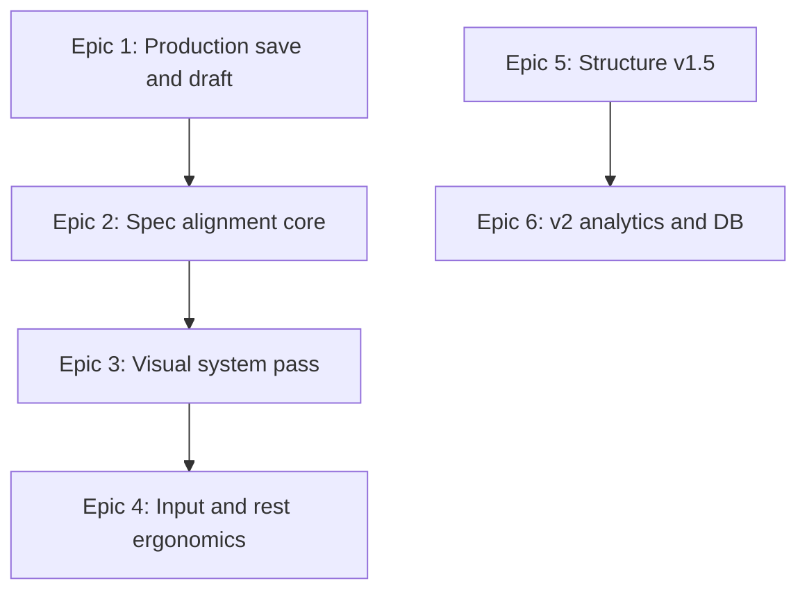

# Аудит дизайна тренировочного процесса Trainly

**Дата:** 2026-05-17  
**Версия UI:** Workout Screen v1 (calm premium)  
**Метод:** code review + сверка с [`WORKOUT_FLOW_SPEC.md`](../WORKOUT_FLOW_SPEC.md); ручной прогон сценариев рекомендован на устройстве (375×812, Telegram WebView).

---

## 1. Executive summary

### Топ-5 проблем

| # | Проблема | Severity | Тип |
|---|----------|----------|-----|
| 1 | **Черновик не пишется в PostgreSQL** во время логирования — `WorkoutLogger` только `syncOverviewWorkoutDraft` в память; `saveWorkoutDraft` из Live не вызывается | Critical (live) | Spec debt + tech |
| 2 | **Finish без UX ошибок** — `void Promise.resolve(addCompletedWorkout)`, `finishPending = false`; сбой server action не показывается | Major (live) | Tech → design |
| 3 | **«Учесть» не на главном экране** — блок перенесён в таб «Заметки»; отклонение от spec §6 (осознанное v1, но +1 тап) | Major | Spec / UX |
| 4 | **Нет Replace exercise, reorder, superset, Add exercise sheet** — spec §7, §14–15; Structure — упрощённый список | Major | Spec gap |
| 5 | **History без «Открыть тренировку»** — spec §13; только insert previous | Major | Spec gap |

### Топ-5 quick wins

| # | Улучшение | Effort | Файлы |
|---|-----------|--------|-------|
| 1 | Добавить `aria-controls` / `id` на табы | S | `WorkoutContentTabs.tsx` |
| 2 | Показать объём и «сессий осталось» в `finish_confirm` | S | `WorkoutLogger.tsx` |
| 3 | Компактная строка «Учесть» под KPI (1 строка + tap → таб Заметки) | S | `WorkoutLogger.tsx`, новый strip |
| 4 | Унифицировать summary CTA: `app-cta-finish` / `premium-surface` вместо `tg-accent` | S | `WorkoutLogger.tsx` summary |
| 5 | Настройка авто-отдыха: off / 60 / 90 / 120 или только по кнопке в footer | S | `WorkoutLogger.tsx` `patchSet` |

---

## 2. Окружение и baseline

### Runtime-пути

| Режим | Провайдер | Workout logger | Черновик | Finish |
|-------|-----------|----------------|----------|--------|
| **Mock** | [`MockAppProvider`](../lib/mock/MockAppProvider.tsx) | `useMockApp()` | In-memory ref → overview preview; «до закрытия вкладки» | Sync mock journal |
| **Live** | [`LiveTrainlyProvider`](../lib/live/LiveTrainlyProvider.tsx) | Тот же `useMockApp()` через общий context | Ref + **есть** `trainlySaveWorkoutDraftAction`, но **логгер не вызывает** | Async `trainlyAddCompletedWorkoutAction` |

**Вывод анализа (code):** сценарии S1–S8 **логически реализованы в mock**; для **postgres помечено «gap / не верифицировано вручную»** там, где нет персистентности и error UI.

### Карта компонентов (logging phase)

```
WorkoutScreenHeader
WorkoutSessionContextCard
WorkoutLiveStatsRow
WorkoutContentTabs
  ├─ exercises → ExerciseCard[] → SetRowEditor
  └─ notes → WorkoutNotesPanel
WorkoutStickyFooter (fixed z-40)
Sheets z-60 | Modals z-70
BottomNav hidden on /workout
```

### Screen inventory (без скриншотов — точки для ручного capture)

| Screen ID | Состояние | Что снимать |
|-----------|-----------|-------------|
| W-log-empty | 0 упражнений | header, KPI, dashed card, footer |
| W-log-active | 2–3 упр., часть ✓ | карточка, KPI live, rest expanded |
| W-log-notes | Таб «Заметки» | Учесть + textarea |
| W-log-focus | Focus on | один card + nav N/M |
| W-sheet-structure | Open | список + add |
| W-sheet-more | Open | menu steps |
| W-sheet-history | With/without data | insert CTA |
| W-modal-safe-exit | dirty back | 3 кнопки |
| W-modal-finish | finish_confirm | stats + note |
| W-summary | completed | KPI row + links |

Рекомендуемая папка для скринов: `docs/assets/workout-audit/` (создать при ручном прогоне).

---

## 3. Journey maps (S1–S8)

Шкала: **Pass** / **Pass*** (с оговорками) / **Fail** / **N/A live**

| ID | Сценарий | Mock (code) | Live (code) | Заметки |
|----|----------|-------------|-------------|---------|
| **S1** | Пустая → 3 упр. → finish | **Pass*** | **Pass*** | Цепочка: add → fill → `openFinishFlow` → modals OK. Нет dedicated Add Exercise sheet (имя в карточке/structure). |
| **S2** | Repeat + insert previous | **Pass*** | **Pass*** | Repeat: `StartWorkoutFlow` + `prepareRepeatFromWorkout`. Insert: `HistorySheet` — нет auto-insert (spec OK). Нет «Open workout». Demo hints по `exercise.id` возможны. |
| **S3** | Черновик → overview → continue | **Pass** | **Fail** | Mock: `syncOverviewWorkoutDraft` + `consumeOverviewDraftBootstrap`. Live: preview есть, **DB draft не обновляется** из логгера. |
| **S4** | Safe exit (back / popstate) | **Pass** | **Pass** | `beforeunload` + `popstate` → `safe_exit`. Копирайт близок к §17 (заголовок «Сохранить черновик?» vs spec «Save workout?»). |
| **S5** | Focus + skip + drop | **Pass*** | **Pass*** | Focus: один card, N/M. Skip: MoreSheet. Drop: `appendDropRow`, indent UI. Focus считает **все** exercises включая skipped в M. |
| **S6** | Time set + mixed types | **Pass*** | **Pass*** | Header row при смене `setType` между строками. Time row: сек + ✓, comment внизу (не в строке как spec §8). |
| **S7** | 0 подходов → note | **Pass** | **Pass*** | `no_filled` → `finalizeNoteSession`. Live: ошибка save не в UI. |
| **S8** | 20+ упр., scroll, footer | **Not run** | **Not run** | Нужен ручной stress: `mainBottomPad` calc, `scroll-mt-24` на cards. Риск: длинный scroll + fixed footer. |

---

## 4. Spec gap matrix (§6–§19)

Легенда приоритета: **P0** блокер · **P1** core spec · **P2** polish · **P3** v2/defer

| § | Требование spec | Реализация | Gap | Pri |
|---|-----------------|------------|-----|-----|
| **6** | List-first scrollable cards | Да, таб «Упражнения» | — | — |
| **6** | Client, title, elapsed, draft status | Header + context + KPI время; badge «Черновик/Сохранено» | Нет Saving/Failed/Offline | P1 |
| **6** | «What to remember» на главном | Только таб «Заметки» | +1 тап; spec example on main | P1 |
| **6** | Sticky: Structure + Finish | + «+ Упр.», rest timer | Расширение v1 (OK если зафиксировать) | P2 |
| **6** | No fake 0 kg volume | `formatSummaryVolumeCell`, `WORKOUT_VOLUME_NOT_CALCULATED_RU` | — | — |
| **7** | History button on card | В MoreSheet «История» | Не на карточке (2 тапа) | P2 |
| **7** | Replace exercise | Нет | Missing | P1 |
| **7** | Comment on exercise | MoreSheet textarea | OK | — |
| **7** | All set actions | Add set, type, drop, skip, delete | OK | — |
| **8** | Set row fields | Table №/Вес/Повт/✓ | OK | — |
| **8** | Tap set number → type | Только More → pick row | Extra steps | P2 |
| **9** | Filled/volume rules | `calculations.ts` | — | — |
| **10** | Set types MVP | 6 types in More | OK | — |
| **11** | Drop visual nest | border-l indent | OK | — |
| **12** | Superset groups | Нет | v2 / MVP gap | P3 |
| **13** | History: last 3, comment, insert | Да | — | — |
| **13** | Open past workout | Нет | Missing | P1 |
| **14** | Structure: reorder, superset, note | Jump, rename, add by name | No reorder/superset/note | P1/P3 |
| **15** | Add exercise sheet (search, recent) | Structure inline input + blank card | Simplified | P1 |
| **16** | Draft autosave + statuses | Dirty sig; overview sync only | No DB autosave from logger | P0 live |
| **16** | Overview unfinished draft | Preview card | Mock session-only | P0 live |
| **17** | Safe exit copy/actions | 3 actions, close Russian | Title wording diff | P2 |
| **17** | Mini App close no data loss | beforeunload only | No Telegram `enableClosingConfirmation` | P2 |
| **18** | Completion validation | Modals: no_filled, empty_exercises, unnamed | OK | — |
| **19** | Finish: counts, duration, note, remaining | Counts + duration + note in modal | No volume, no remaining sessions in modal | P1 |
| **19** | Payment warning if needed | Не в finish modal | Зависит от start flow | P2 |

### v1 vs spec debt (явная классификация)

| Категория | Примеры |
|-----------|---------|
| **Осознанное v1** | 2 таба; finish только в footer; RPE/rest per-set нет; KPI без «vs прошлая»; BottomNav скрыт |
| **Исторический spec debt** | Replace, reorder, Add exercise sheet, Open workout, superset |
| **Регрессии / недоделки v1** | Live draft не из логгера; finish error UI; demo hints vs journal |

---

## 5. Heuristic heatmap (0 / 1 / 2)

Шкала: 0 = нет · 1 = частично · 2 = хорошо

| Блок | Скорость ввода | Статус | Предсказуемость | Ошибки | Консистентность | Плотность |
|------|----------------|--------|-----------------|--------|-----------------|-----------|
| Header | 2 | 1 | 2 | — | 2 | 2 |
| Context card | 2 | — | 2 | — | 2 | 2 |
| KPI row | — | 2 | 2 | — | 2 | 2 |
| Tabs | 1 | — | 2 | — | 2 | 2 |
| ExerciseCard | 2 | — | 2 | — | 2 | 1 |
| SetRowEditor | 2 | 1 | 2 | — | 2 | 2 |
| Footer | 2 | 1 | 2 | — | 2 | 1 |
| Sheets | 1 | — | 2 | 2 | 1 | 2 |
| Summary | — | 1 | 2 | 1 | 1 | 2 |
| Modals | — | — | 2 | 2 | 1 | 2 |

**Слабые места:** статус сохранения (1), sheets/consistency (legacy `tg-*` в History insert), summary CTA не `app-cta-finish`.

---

## 6. Interaction & bugs (верификация по коду)

| Область | Статус | Детали |
|---------|--------|--------|
| Structure → «К карточке» + таб | **Fixed** | `jumpToExercise` → `setContentTab('exercises')` |
| Add exercise scroll | **Fixed** | `queueMicrotask` + scroll anchor |
| History из ⋮ | **OK** | More closes, History opens (z-60) |
| Focus + skipped | **Minor** | M включает skipped; focus index может показать skipped card |
| KPI volume | **OK** | null → «Объём не рассчитан» / «—» |
| Auto rest 90s on ✓ | **Product** | Старт если таймер не активен; может мешать — нужен UX poll |
| Keyboard vs footer | **Verify manual** | fixed footer; нет `visualViewport` padding |
| Long names | **OK** | truncate на title/client |
| `saveDraftBaseline` | **Clarify** | Сбрасывает dirty baseline, не пишет в DB |
| Safe exit «Выйти без сохранения» | **Major** | `resetWorkout()` → `/start-workout`, данные теряются (ожидаемо по кнопке) |
| Modal scrim vs footer | **OK** | modal z-70, pb учитывает nav |
| Duplicate More+History z-index | **OK** | Один sheet at a time |

---

## 7. Доступность и Telegram Mini App

| Критерий | Статус | Рекомендация |
|----------|--------|--------------|
| `role="tablist"` / `aria-selected` | Partial | Добавить `id` табов, `aria-controls` на panel, `tabIndex` |
| Touch targets ≥44px | Partial | ✓ кнопка h-10–11; ⋮ 36px — увеличить до 44px |
| Focus visible | Partial | Полагаться на browser defaults |
| `prefers-reduced-motion` | Fail | `scrollIntoView({ behavior: 'smooth' })` всегда — уважать reduced motion |
| Dialog labels | Partial | `role="dialog"` на modals; sheets имеют `aria-labelledby` |
| Telegram MainButton | Fail | Не используется для Finish |
| Telegram BackButton | Fail | Не связан с `handleBack` / safe exit |
| Closing confirmation | Partial | `beforeunload` в web; не TMA API |

---

## 8. Design blockers (техника → UX)

1. **`WorkoutLogger` не вызывает `saveWorkoutDraft`** — live persistence [`lib/server/workoutDrafts.ts`](../lib/server/workoutDrafts.ts) недоступна из UI логгера.
2. **`finishPending` / `saveError` отсутствуют** — нет состояния сохранения и ошибок ([`WorkoutLogger.tsx`](../components/workout/WorkoutLogger.tsx) ~248).
3. **`addCompletedWorkout` fire-and-forget** — `void Promise.resolve(...)`; live throw не ловится.
4. **Demo data leak** — `demoExerciseCardHints[exercise.id]`, `demoExerciseHistory[exerciseId]` после journal fallback.
5. **Монолит `WorkoutLogger`** (~1130 строк) — высокий риск регрессий при polish.
6. **Mock `saveWorkoutDraft` noop** — всегда `{ ok: true }`; маскирует интеграционные проблемы в dev без postgres.

---

## 9. Визуальный аудит (calm premium)

| Критерий | Оценка | Комментарий |
|----------|--------|-------------|
| Иерархия header vs cards | Good | flat header + `premium-surface` cards |
| KPI tiles | Good | 2×2 grid, tabular nums |
| CTA finish | Good | `.app-cta-finish` green |
| Empty state CTA | Inconsistent | `app-cta-gradient` на пустом списке vs green finish |
| Summary phase | Inconsistent | `bg-[var(--tg-card)]`, `tg-accent` links — старые токены |
| Sheets | Good | `--bg-sheet`, `--radius-sheet`, handle bar |
| Skipped card | Good | dashed, opacity |
| Done row | Good | success tint |
| z-index stack | OK | nav hidden, footer 40, sheet 60, modal 70 |
| Continuity start → workout | Verify | Сравнить с [`StartWorkoutFlow`](../components/start-workout/StartWorkoutFlow.tsx), [`OverviewPageContent`](../components/overview/OverviewPageContent.tsx) |

---

## 10. Prioritized backlog (MoSCoW)

### P0 — Critical

| ID | Item | Files |
|----|------|-------|
| W-001 | Debounced `saveWorkoutDraft` из `WorkoutLogger` при dirty (live) | `WorkoutLogger.tsx`, `LiveTrainlyProvider` |
| W-002 | Обработка ошибок finish: `finishPending`, `saveError`, не глотать throw | `WorkoutLogger.tsx` |
| W-003 | Восстановление черновика из DB на continue (overview / start) | `OverviewPageContent`, actions, logger bootstrap |

### P1 — Major (core spec / UX)

| ID | Item | Files |
|----|------|-------|
| W-101 | Компактный «Учесть» на logging (strip → таб Заметки) | новый компонент + `WorkoutLogger` |
| W-102 | Finish modal: объём + остаток сессий + payment hint | `WorkoutLogger.tsx` |
| W-103 | History: «Открыть тренировку» | `HistorySheet`, journal route |
| W-104 | Replace exercise (swap name/structure, keep order) | `MoreSheet` или Structure |
| W-105 | Draft badge: Saving / Saved / Failed | header + save hook |
| W-106 | Убрать demo hints когда есть journal history | `WorkoutLogger` map hints |

### P2 — Minor (polish)

| ID | Item | Files |
|----|------|-------|
| W-201 | Summary: `premium-surface`, `app-cta-finish`, link tokens | `WorkoutLogger` summary |
| W-202 | `aria-controls` на табах | `WorkoutContentTabs.tsx` |
| W-203 | ⋮ touch target 44px | `ExerciseCard.tsx` |
| W-204 | `prefers-reduced-motion` для scroll | `WorkoutLogger` jumpToExercise |
| W-205 | Настраиваемый авто-rest (off/60/90/120) | `patchSet`, footer |
| W-206 | Safe exit title/copy vs spec §17 | modals |
| W-207 | History insert button: `app-cta-finish` или secondary consistent | `HistorySheet.tsx` |
| W-208 | Telegram BackButton + closing confirmation | новый hook `useTelegramWorkoutChrome` |

### P3 — Enhancement / v2

| ID | Item |
|----|------|
| W-301 | Reorder exercises (Structure drag) |
| W-302 | Superset groups |
| W-303 | Add exercise sheet (search, recent, favorites) |
| W-304 | RPE / rest per set + DB migration |
| W-305 | KPI vs прошлая тренировка |
| W-306 | Tap set number → change type |
| W-307 | Редактирование `startedAtMs` |

---

## 11. Рекомендуемые эпики (следующие PR)



| Epic | Scope | Backlog IDs |
|------|-------|-------------|
| **1. Production save & draft** | DB autosave, load/discard, finish error UI | W-001–003, W-002, W-105 |
| **2. Spec alignment (core)** | Remember strip, finish fields, history open, replace | W-101–104, W-106 |
| **3. Visual system pass** | Summary + History CTA + empty state CTA | W-201, W-207 |
| **4. Input & rest ergonomics** | Keyboard padding, auto-rest policy, a11y tabs/motion | W-202–205 |
| **5. Structure v1.5** | Reorder client-side; defer superset | W-301 |
| **6. v2** | RPE, KPI trends, add-exercise sheet | W-303–307 |

---

## 12. Критерии готовности анализа

- [x] Сценарии S1–S8 оценены (code); S8 stress — помечен для ручного прогона
- [x] Spec gap matrix §6–§19 покрыта
- [x] Screen inventory задан (точки для скринов)
- [x] Backlog ≥ 10 items с paths и priority
- [x] Разделение v1 / spec debt / live gaps
- [ ] Скриншоты в `docs/assets/workout-audit/` — **осталось при ручном прогоне**
- [ ] Live postgres прогон S3, S7, finish error — **рекомендуется QA**

---

## Приложение A: Сценарии S1–S8 (шаги для ручного QA)

### S1 — Core finish
1. `/start-workout` → клиент → пустая тренировка  
2. Добавить 3 упражнения (footer + structure)  
3. Заполнить ≥1 подход в каждом, finish → confirm → summary  
4. «Открыть запись» → journal entry  

### S2 — Repeat + history
1. Journal → деталь → repeat  
2. На /workout → ⋮ → История → Вставить прошлые  
3. Проверить: значения не подставились без кнопки  

### S3 — Draft
1. Начать тренировку, изменить title + 1 подход  
2. Overview → «Продолжить»  
3. **Live:** перезагрузка страницы — ожидание восстановления из DB (сейчас gap)  

### S4 — Safe exit
1. Dirty → system back / header back  
2. Сохранить черновик → overview draft  
3. Выйти без сохранения → данные сброшены  

### S5 — Focus / skip / drop
1. 3+ упражнений → Фокус  
2. Пропустить via More  
3. Дроп-сет на рабочем подходе  

### S6 — Time / mixed
1. More → тип «Время» на подходе  
2. Второй подход «Рабочий» — два header row  

### S7 — Note
1. Finish без подходов → «Сохранить как заметку»  

### S8 — Stress
1. Structure: добавить 15–20 упражнений  
2. Скролл, jump, footer не перекрывает inputs  

---

*Документ подготовлен по плану Workout Design Audit. Следующий шаг: утвердить backlog и начать Epic 1 или quick wins (W-201–W-202).*
